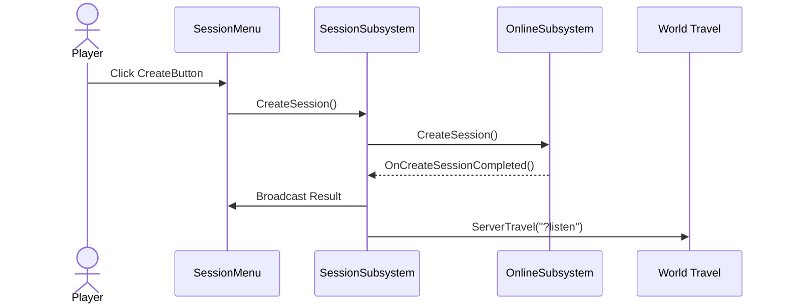
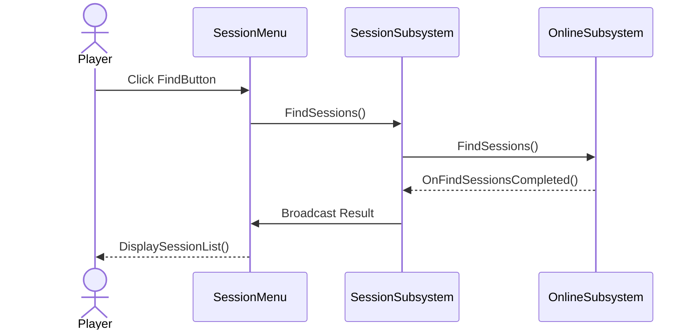
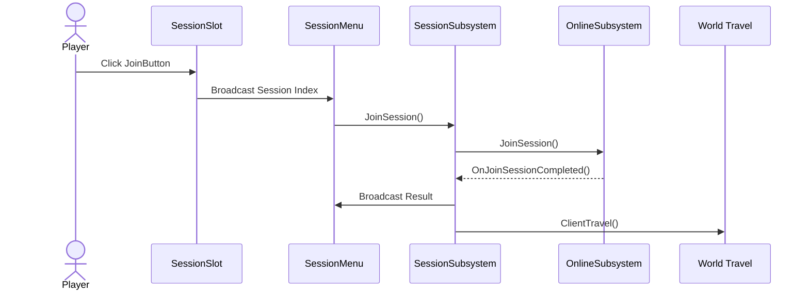

## 개요
Session 시스템은 플레이어가 세션을 생성하거나 검색 / 참가한 뒤,
로비를 거쳐 Gameplay Level로 이동하기 위한 멀티플레이 진입 흐름을 담당합니다.

현재는 Online Subsystem Null 기반의 로컬 멀티플레이 환경에서 테스트하고 있습니다.

## 레벨 흐름

```txt
Session → Lobby → Gameplay
```

### Session
세션 메뉴에서 세션을 생성하거나 검색 / 참가합니다.

### Lobby
세션 참가 후 플레이어들이 모이는 공간입니다.

세션 정보와 플레이어 Ready 상태가 이곳에서 동기화됩니다.

### Gameplay
모든 플레이어가 Ready 상태가 되면 ServerTravel을 통해 LV_Gameplay로 이동합니다.

---
## SessionSubsystem

`UGameInstanceSubsystem`을 상속한 세션 전담 서브시스템입니다.

### 역할
- 세션 생성
- 세션 검색
- 세션 참가
- Online Session Delegate 바인딩 및 해제
- 세션 결과를 UI 또는 게임플레이 시스템에 전달

### 설계 판단
UI는 세션 요청만 보내고, 실제 Online Subsystem 처리는 SessionSubsystem에서 수행합니다.

`ESessionState`를 사용하여 중복 요청을 방지합니다.

```cpp
enum class ESessionState : uint8
{
	Idle,
	Creating,
	Finding,
	Joining,
};
```

위젯 소멸 시에는 `RemoveAll(this)`를 사용해 Delegate 중복 바인딩과 잘못된 콜백 호출을 방지합니다.

---
## 세션 흐름

### CreateSession



### FindSessions



### JoinSession



